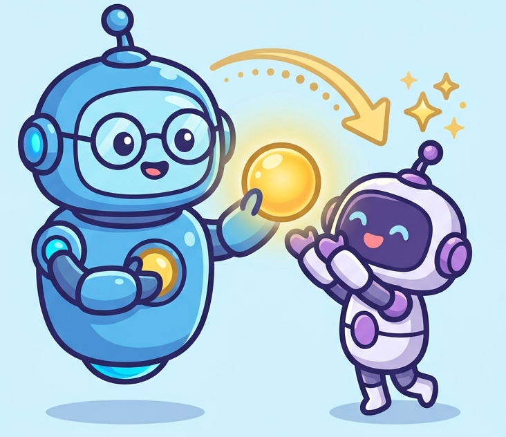
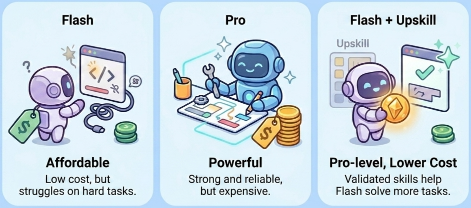
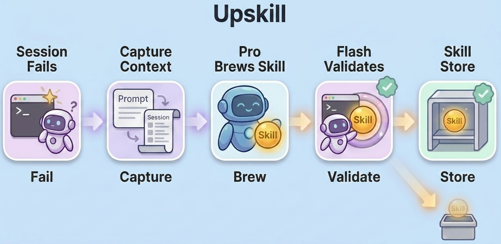
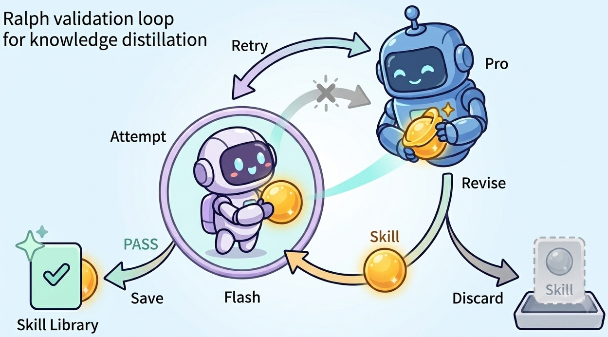

<div align="center">

<p align="center">

</p>

## ✨ Upskill 你的模型 — 而非你的账单 ✨

将你的 Flash 模型变成 Pro。无需升级模型。

[](https://docs.anthropic.com/en/docs/claude-code)
[](https://opensource.org/licenses/MIT/)
[](./COMMUNICATION.md)
[](./COMMUNICATION.md)
[](./README.md)

**将 UpSkill 集成到你的 Claude Code — 一行命令即可**

<p align="center">
" />
</p>

</div>

---

## 📰 新闻

- **2026-06-18** — 首次发布：Upskill v1.0 — 知识蒸馏框架，自动捕获 agent 任务失败、通过 Ralph Loop 蒸馏为经过验证的技能并注入未来会话，使弱模型以更低成本超越强模型，完整集成 Claude Code。

---

## 📋 目录

- [🤔 问题](#-当今-ai-agent-的问题)
- [🔬 UpSkill 实战检验](#-upskill-实战检验)
- [🚀 快速开始](#-快速开始)
- [📚 使用技能](#-使用技能)
- [🏗 UpSkill 工作原理](#-upskill-工作原理)
- [📖 仓库结构](#-仓库结构)
- [🔬 复现实验](#-复现实验)
- [📄 许可证](#-许可证)

---

## 🤔 当今 AI Agent 的问题

<p align="center">

</p>

AI Agent（Claude Code、Codex、Cursor、OpenClaw、Hermes、nanobot）功能强大 <br>—— 但一个残酷的事实始终存在：**它们的表现最终受限于你所付费的模型**。

- ❌ **Pro 模型太贵** —— Claude Opus、GPT-5.5、Gemini-Pro 表现出色，但单任务成本高出 3–5 倍。全天运行根本不现实。

- ❌ **Flash 模型不够可靠** —— Claude Haiku、GPT-5.5 mini、Gemini-Flash 价格亲民，但表现达不到 Pro 模型的水准。最后修复错误花的时间比省下的还多。

这就是我们构建 UpSkill 的原因 —— 一个轻量级框架，通过持续**进化技能**，让你的 Flash 模型获得 Pro 级别的表现。

---

## 🔬 UpSkill 实战检验

- **基准测试**：**Terminal-Bench 2.0** —— 89 个真实终端任务，涵盖 16 个类别，横跨软件工程、数据科学、系统管理、安全等领域。

- **实验设置**：分层 25/64 训练/测试集划分 —— 从 25 个训练任务上的基础模型轨迹中蒸馏技能，然后部署到 64 个留出测试任务上。

- **结果**：所有指标均在留出测试集上报告。

| | 🟡 Flash 模型<br>(deepseek-v4-flash) | 🔵 Pro 模型<br>(deepseek-v4-pro[1m]) | 🟢 Flash 模型 + Upskill |
|---|:--:|:--:|:--:|
| **测试通过率** | 45.3% | 50.0% | **51.6%** |
| **测试成本** | $1.93 | $4.01 | **$2.36** |
| **单任务成本** | $0.03 | $0.06 | **$0.04** |

> 💡 一个 **$0.04/任务的 Flash** 模型，经过 **UpSkill** 增强，性能超过了 **$0.06/任务的 Pro** 模型 —— 以 **41% 更低的成本**实现可比的结果。

### 📊 实践意义

- ✅ **5 个任务从 FAIL 翻转为 PASS** —— count-dataset-tokens、headless-terminal、query-optimize、mailman、winning-avg-corewars
- ✅ **最大类别增益** —— model-training (+33%)、data-science (+17%)、system-administration (+17%)、software-engineering (+11%)
- ✅ **UpSkill 一次性技能生成成本**：64 个任务约 $2 —— 微小的开销换来惠及所有未来任务的技能。

> 完整结果：[`tb_harbor_2.0/RESULTS.md`](tb_harbor_2.0/RESULTS.md)

---

## 🚀 快速开始

### 1. 安装

```bash
curl -sSL https://raw.githubusercontent.com/HKUDS/Upskill/main/cc-integration/install.sh | bash -s -- --remote
```

> [!TIP]
> 安装脚本已自动完成所有设置——hooks、skills、配置和存储。如需更新到最新版，随时运行 `/upskill-init`。

### 2. 配置模型

`/upskill-init` 会创建 `~/.claude/upskill.conf`。编辑它以设置你的 Teacher 和 Student 模型。我们推荐使用 DeepSeek 模型以获得最佳性价比：

```bash
# ~/.claude/upskill.conf
UPSKILL_TEACHER="deepseek-v4-pro[1m]"   # 强模型，用于分析 + 技能生成
UPSKILL_STUDENT="deepseek-v4-flash"     # 弱模型——技能将针对此模型验证
```

或使用 Anthropic 模型：

```bash
UPSKILL_TEACHER="claude-opus-4-7"       # 强模型
UPSKILL_STUDENT="claude-haiku-4-5"      # 弱模型
```

> [!NOTE]
> 你的日常模型保持独立——日常使用任何你想要的模型。随时切换而不影响 Upskill。使用 `/upskill-model` 查看当前预设。

### 3. 按项目启用

在每个你想启用技能构建的项目中运行：

```bash
/upskill-configure
```

这将配置项目的 hooks，使 Upskill 能够自动捕获失败并注入技能。

### 4. 使用你的 Agent——技能自动构建

正常使用你的 Agent。当任务失败时，Upskill 自动捕获完整的会话上下文。下次打开 Agent 时，你会看到：

```
[upskill] ⚠ 1 个待处理的失败，可运行 /upskill-build 生成技能。
```

运行 `/upskill-build`，Teacher 模型会接管——它分析失败原因，生成技能，Ralph Loop 会用 Student 模型验证该技能。验证通过的技能被存储并自动注入所有未来的会话。无需更改配置，无需手动提示。

你也可以在任何历史 session 上主动运行 `/upskill-build`——包括成功的任务——将好的模式提炼为可复用的技能。

---

## 📚 使用技能

### 命令一览

| 命令 | 功能 |
|---------|-------------|
| `/upskill-build` | 分析历史 session（失败或成功）并生成技能 |
| `/upskill-run` | 交互式工作流：扫描技能 → 匹配 → 应用 |
| `/upskill-list` | 按类别浏览所有已安装技能 |
| `/upskill-status` | 查看技能数量和活动构建 |
| `/upskill-configure` | 在当前项目中启用 Upskill hooks |
| `/upskill-model` | 查看或切换 Teacher / Student 模型 |
| `/upskill-mode` | 切换交互模式与自动服务模式 |
| `/upskill-remove` | 删除一个技能或类别 |
| `/upskill-uninstall` | 完全移除 Upskill |

### /upskill-run 使用示例

`/upskill-run` 是交互式技能应用工作流。它不会静默注入技能，而是让你浏览、比较并选择最适合当前任务的技能。

**示例——处理一个 CSV 筛选任务：**

```
> /upskill-run 根据列值筛选 CSV 文件

以下是可用的技能：

  ★ 1. data-analysis/skill_20260605_001  [推荐]
     Python CSV 数据处理工具——筛选/排序/选择
     验证模型：deepseek-v4-flash  (当前：deepseek-v4-flash ✓)

    2. software-engineering/skill_20260606_005
     Python CLI 工具 argparse 模式
     验证模型：deepseek-v4-flash  (当前：deepseek-v4-flash ✓)

★ = 匹配你的任务。输入编号选择（逗号分隔），或输入 "none" 跳过。
```

你选择 `1`——Agent 加载 SKILL.md，读取分步清单和常见陷阱，然后用提炼好的知识执行你的 CSV 任务。如果所选技能的验证模型与当前模型不同，`/upskill-run` 会先提示你切换模型。

### 技能如何在你的 Agent 中出现

技能构建完成后，你的 Agent 会自动在其上下文中看到它们。例如，在 `data-analysis` 类别中构建几次后：

```markdown
## Skill: data-analysis（3 个技能）
**基础模型：** deepseek-v4-flash
**触发词：** csv, encoding, json, database, query
**模型：** 已在 `deepseek-v4-flash` 上验证。为获得最佳效果，请使用此模型。

  - `skill_20260605_001`——Python CSV 数据处理工具，支持筛选/排序
    → 阅读 `~/.claude/upskill-store/data-analysis/skill_20260605_001/SKILL.md`
  - `skill_20260605_002`——数据库查询优化，正确使用索引
    → 阅读 `~/.claude/upskill-store/data-analysis/skill_20260605_002/SKILL.md`
```

每个技能是一个带 YAML frontmatter 和三个 section 的 `SKILL.md` 文件，经由 Ralph Loop 验证：

```
~/.claude/upskill-store/<category>/<skill_id>/
├── SKILL.md           # 完整技能文件
└── description.txt    # 一句话摘要
```

`SKILL.md` 结构：

```markdown
---
name: skill_20260605_001
description: 适用于 Python CSV 数据处理工具...
metadata:
  category: data-analysis
  base_model: deepseek-v4-flash
  created: 2026-06-05T12:34:56
  trigger_keywords: [csv, encoding, json, database, query]
---

# Domain Knowledge
常见陷阱、正确方法和验证清单。
（服务时：注入 Agent 的 CLAUDE.md）

# Step-by-Step
有序清单，包含具体命令和代码片段。
（服务时：按需加载为 solve-task 技能）

# Feedback / Lessons
Rule: <简洁规则>
Why: <为什么重要>
How to apply: <如何遵循>
（服务时：随完整 SKILL.md 一起加载）
```

三段内容通过两个渠道交付：CLAUDE.md 索引（始终在上下文）和 SKILL.md 按需加载——一个经过验证的文件，两条交付路径。

### 服务模式

| 模式 | 行为 |
|---|---|
| **interactive**（默认） | 使用 `/upskill-run` 浏览技能并选择要应用的。 |
| **auto** | 每次提示时自动匹配关键词。Agent 主动推荐相关技能。 |

```bash
/upskill-mode              # 查看当前模式
/upskill-mode auto         # 切换到自动模式
/upskill-mode interactive  # 切换到交互模式
```

> 完整文档：[`cc-integration/README.md`](cc-integration/README.md)

---

## 🏗 UpSkill 工作原理

UpSkill 以轻量级会话 hooks 的形式集成到你的 Agent 中——无需改动基础设施。系统在三个角色间协作：

🟡 **日常模型** —— 你选择的模型，处理日常任务<br>
🔵 **Pro 模型** —— 强模型，负责分析失败和生成技能<br>
🟢 **Flash 模型** —— 弱模型，所有技能必须在部署前对此模型验证通过

当会话结束时，hooks 捕获结果。失败时，完整上下文被保留并传递给 Pro 模型进行分析。

### 技能构建流程

技能存储后，通过两个渠道自动交付到未来的会话中：
- **CLAUDE.md 索引** —— 始终在上下文，每个技能约 5 行，含摘要和触发关键词
- **SKILL.md 按需加载** —— 通过 `/upskill-run`（交互模式）或关键词自动匹配（auto 模式）加载；包含全部三段（Domain Knowledge、Step-by-Step 和 Feedback/Lessons）

<p align="center">

</p>

### Ralph Loop——为什么验证是难点

大多数方法过早停止：Pro 模型写建议、保存、然后期望有用。问题在哪？强模型的建议并未针对弱模型行为校准——Flash 模型可能不知道如何或何时应用它。

<p align="center">

</p>

**Ralph Loop 填补了这个缺口：**
- **第 1 轮** —— Flash 模型失败。Pro 模型分析失败并生成初始技能。
- **第 2 轮** —— Flash 模型带技能重试。如果仍然失败，Pro 模型基于更丰富的信号修正："有了我的指导，哪里还不对？"循环持续直到技能被证明有效。

**为什么这很重要：**
- ✅ **针对 Flash 模型校准** —— Flash 模型已验证能遵循的指令，而非泛泛的最佳实践
- ✅ **每轮产生更强的信号** —— 带着指导失败，精确定位建议的失效点
- ✅ **质量胜于数量** —— 未通过验证的技能被丢弃；每个条目都经过实战检验

这就是 UpSkill 能将弱模型推向超越训练它的强模型的原因：
- 📚 技能编码了 Pro 模型的知识
- 🔄 经过 Flash 模型实际行为的修正
- 🎯 结果：精准、经过实战检验的指导，这是仅靠强模型永远无法产出的

---

## 📖 仓库结构

<details>
<summary><b>点击展开</b></summary>

```
Upskill/
│
├── cc-integration/           ← Upskill 插件（安装内容）
│   ├── install.sh             # 一键安装器
│   ├── upskill-build.sh       # 构建流程（核心）
│   ├── upskill-store.sh       # 技能库管理
│   ├── hooks/                 # 会话 hooks（before/after session）
│   ├── skills/                # 斜杠命令（/upskill-*）
│   ├── templates/             # 配置模板
│   └── README.md              # 完整使用文档
│
├── figures/                   ← 图表与插图
│   ├── logo.png               # 项目 Logo
│   ├── motivation.png         # Student vs Teacher vs Upskill
│   ├── pipeline.png           # 构建流程总览
│   ├── ralph_loop.png         # Ralph 验证循环
│   └── demo-typing.svg        # 终端动画演示
│
├── tb_harbor_2.0/            ← Terminal-Bench 2.0 实验
│   ├── tasks/                 # 89 个基准任务（16 个类别）
│   ├── train.txt / test.txt   # 25/64 分层划分
│   ├── RESULTS.md             # 实验结果
│   └── REPRODUCE.md           # 逐步复现指南
│
├── scripts/                   # 实验流程脚本
│   ├── run_baseline.sh        # Student 和 Teacher 基线
│   ├── run_brew.py            # 按任务生成技能
│   ├── run_curator.py         # 按类别整理技能
│   ├── run_ralph.py           # Ralph 验证循环
│   ├── run_serve.sh           # 部署技能到测试集
│   ├── run_analyze.py         # 结果分析
│   ├── build_catalog.py       # 技能目录构建
│   ├── split_dataset.py       # 训练/测试集划分
│   ├── patch_harbor.sh        # Harbor 框架补丁
│   └── ...                    # 其他辅助脚本
│
└── configs/                   # 模型配置模板
    ├── strong.env.template    # Teacher 模型配置
    └── weak.env.template      # Student 模型配置
```

</details>

---

## 🔬 复现实验

TB 2.0 实验遵循 6 步流程：

```
Baselines → Brew → Curate → Ralph → Serve → Analyze
```

前置条件：macOS（或带 Docker 的 Linux）、Python 3.12+、Docker Desktop、Git LFS。

<details>
<summary><b>快速设置</b></summary>

```bash
# 1. 安装 Harbor
python3.13 -m venv .venv_harbor && source .venv_harbor/bin/activate
pip install harbor && bash scripts/patch_harbor.sh

# 2. 配置 API keys
cp configs/strong.env.template configs/strong.env
cp configs/weak.env.template configs/weak.env
# 编辑两个文件，填入你的 DeepSeek API key

# 3. 运行 baselines → brew → curate → ralph → serve → analyze
```

</details>

完整指南（含预期输出和故障排除）请参阅 [`tb_harbor_2.0/REPRODUCE.md`](tb_harbor_2.0/REPRODUCE.md)。

---

## 📄 许可证

MIT——详见 [LICENSE](LICENSE)。

---

<p align="center">
  <em> ❤️ 感谢访问 ✨ Upskill！</em><br><br>
  
</p>
